# Pearson Specter Litt Legal Workflow

Internal workflow for ingesting messy legal documents, retrieving cited evidence, drafting grounded internal legal memos, and learning from operator edits.

This repository was built for the AI Engineer take-home assessment. It ships with runnable code, tests, synthetic sample inputs, and generated sample outputs.

## What It Builds

The system implements four modules:

1. **Robust document ingestion** (`src/psl_workflow/processing`)
   - Uses PyMuPDF for clean/embedded-text PDFs.
   - Falls back to OCR for scanned PDF pages and image files.
   - Uses Tesseract through `pytesseract` when the system `tesseract` binary is installed.
   - Includes an optional EasyOCR path via `requirements-ocr-extra.txt`.
   - Produces structured JSON with document metadata, raw text, page numbers, extraction method, and OCR diagnostics.

2. **RAG retrieval** (`src/psl_workflow/retrieval`)
   - Uses LangChain + ChromaDB.
   - Chunks each page into source-preserving evidence snippets.
   - Returns snippets with citations like `clean_contract.pdf p.1`.
   - Uses deterministic local hash embeddings for offline demos and tests. This can be swapped for OpenAI embeddings in production without changing the retriever interface.

3. **Grounded drafting** (`src/psl_workflow/generation`)
   - Builds an evidence-only prompt for internal legal memos.
   - Uses a GPT-4-class OpenAI chat model when `OPENAI_API_KEY` is present. Default model is `gpt-4o`, configurable via `OPENAI_MODEL`.
   - Uses a deterministic local fallback when no API key is set, so the full flow remains runnable in review environments.
   - Refuses unsupported drafting when no evidence is retrieved.

4. **Feedback learning loop** (`src/psl_workflow/learning`)
   - Captures draft-to-final operator edits.
   - Stores a diff for auditability, but does not stop at a raw diff.
   - Extracts reusable style/correction rules, such as adding `Risk Level`, `Recommendation`, or `Rationale` sections.
   - Stores before/after examples in SQLite and injects relevant memory into future drafting prompts.

## Quick Start

```bash
python3.12 -m venv .venv
.venv/bin/pip install -r requirements.txt
.venv/bin/python main.py demo
```

Run tests:

```bash
.venv/bin/python -m pytest -q
```

Run the API:

```bash
.venv/bin/python main.py api --host 127.0.0.1 --port 8000
```

Then open `http://127.0.0.1:8000/docs`.

## OCR Setup

For OCR with Tesseract on macOS:

```bash
brew install tesseract
```

Optional EasyOCR support:

```bash
.venv/bin/pip install -r requirements-ocr-extra.txt
```

The code handles missing OCR dependencies gracefully and records `ocr-unavailable` metadata instead of crashing.

## CLI Flow

Generate synthetic legal samples:

```bash
.venv/bin/python main.py generate-samples --output examples/data/samples
```

Ingest a document:

```bash
.venv/bin/python main.py ingest examples/data/samples/clean_contract.pdf
```

Index an ingested JSON:

```bash
.venv/bin/python main.py index data/ingested/clean_contract.json
```

Retrieve cited evidence:

```bash
.venv/bin/python main.py retrieve "Can Wayne terminate immediately and what fee risk applies?"
```

Draft a grounded memo:

```bash
.venv/bin/python main.py draft "Can Wayne terminate immediately and what fee risk applies?" --matter-id wayne-logistics
```

Capture operator feedback:

```bash
.venv/bin/python main.py feedback \
  --matter-id wayne-logistics \
  --query "Can Wayne terminate immediately and what fee risk applies?" \
  --draft-file examples/outputs/first_draft.md \
  --final-file examples/outputs/improved_draft.md
```

## API Endpoints

- `GET /health`
- `POST /ingest` with multipart file upload. Ingests and indexes the document.
- `POST /retrieve` with `{"query": "...", "k": 5}`.
- `POST /draft` with `{"matter_id": "...", "query": "...", "k": 5}`.
- `POST /feedback` with draft/final text.
- `POST /demo` to run the complete sample workflow.

## Sample Inputs and Outputs

Included sample inputs:

- `examples/data/samples/clean_contract.pdf`
- `examples/data/samples/messy_notice.png`
- `examples/data/samples/scanned_notice.pdf`

Generated sample outputs:

- `examples/outputs/evaluation_results.json`
- `examples/outputs/first_draft.md`
- `examples/outputs/improved_draft.md`

The current local evaluation result:

```json
{
  "structured_ingestion": true,
  "citations_returned": true,
  "draft_is_grounded": true,
  "learning_loop_applied": true
}
```

## Architecture

```mermaid
flowchart LR
    A["PDF/Image Upload"] --> B["Processing: PyMuPDF + OCR fallback"]
    B --> C["Structured JSON: metadata, pages, raw text"]
    C --> D["Chunking"]
    D --> E["LangChain + ChromaDB"]
    E --> F["Cited snippets"]
    F --> G["Grounded memo prompt"]
    H["Style/Correction Memory"] --> G
    G --> I["GPT-4-class LLM or local fallback"]
    I --> J["Internal Legal Memo"]
    J --> K["Operator final edit"]
    K --> L["Feedback learner"]
    L --> H
```



## Learning Loop

The feedback loop stores both audit evidence and reusable generation signal:

- `diff_summary`: unified diff between draft and operator final for traceability.
- `extracted_rules`: semantic prompt rules inferred from the edit.
- `before/after examples`: few-shot examples that show the preferred firm style.

Future drafts call `StyleMemory.build_prompt_context(query)`, which ranks prior feedback by query/rule overlap and injects relevant examples into the memo prompt. This means an operator edit like adding `Risk Level: High` and `Recommendation:` changes future output structure, not just the saved version history.

## Assumptions and Tradeoffs

- Legal correctness is outside scope; the goal is evidence-grounded drafting and inspectable support.
- Local hash embeddings keep the project runnable without external model downloads. Production should replace them with a stronger embedding model.
- OCR quality depends on the installed OCR backend and source image quality. Missing OCR is surfaced as structured metadata.
- ChromaDB is embedded for a self-contained assessment build. A production deployment would likely separate vector storage, object storage, and audit logs.
- The local fallback drafter is intentionally conservative and deterministic. Set `OPENAI_API_KEY` for GPT-4-class drafting.

## Ollama Cloud

This project can use Ollama Cloud directly, not only local Ollama. Set:

```bash
export LLM_PROVIDER=ollama
export OLLAMA_BASE_URL=https://ollama.com
export OLLAMA_API_KEY=your_ollama_cloud_api_key
export OLLAMA_MODEL=gpt-oss:120b
```

The app calls `https://ollama.com/api/generate` with `Authorization: Bearer $OLLAMA_API_KEY`.

## Docker (Local)

```bash
docker build -t psl-workflow .
docker run --rm -p 8000:8000 --env-file .env psl-workflow
```

## VPS Deployment

The system is deployed on a VPS with Cloudflare tunnel for public access.

**Live UI:** https://psl.online-bazar.top/

**VPS Setup:**
```bash
# SSH into VPS (replace with your credentials)
ssh -i ~/.ssh/your_key root@YOUR_VPS_IP

# Check container status
docker ps
docker logs psl-workflow --tail 20

# Environment variables (set in docker-compose or .env)
LLM_PROVIDER=local                    # local, openai, or ollama
OLLAMA_BASE_URL=https://ollama.com    # for Ollama Cloud
OLLAMA_MODEL=gpt-oss:120b
OPENAI_API_KEY=sk-xxx                 # for OpenAI (optional)
PORT=8000

# Health check
curl http://127.0.0.1:8010/health
```

**Port Mapping:** Container runs on `127.0.0.1:8010` → exposed via Cloudflare tunnel

**API Docs:** https://psl.online-bazar.top/docs

**Update Deployment:**
```bash
docker pull rahmatullahboss/psl-workflow:latest
docker stop psl-workflow && docker rm psl-workflow
docker run -d --name psl-workflow -p 127.0.0.1:8010:8000 \
  --env-file .env psl-workflow
```

## Submission Checklist

- Source code: included.
- README with setup/run/architecture/tradeoffs: included.
- Sample inputs and outputs: included under `examples/`.
- Tests: included under `tests/`.
- API endpoints: included via FastAPI.
- Evaluation results: included in `examples/outputs/evaluation_results.json`.
